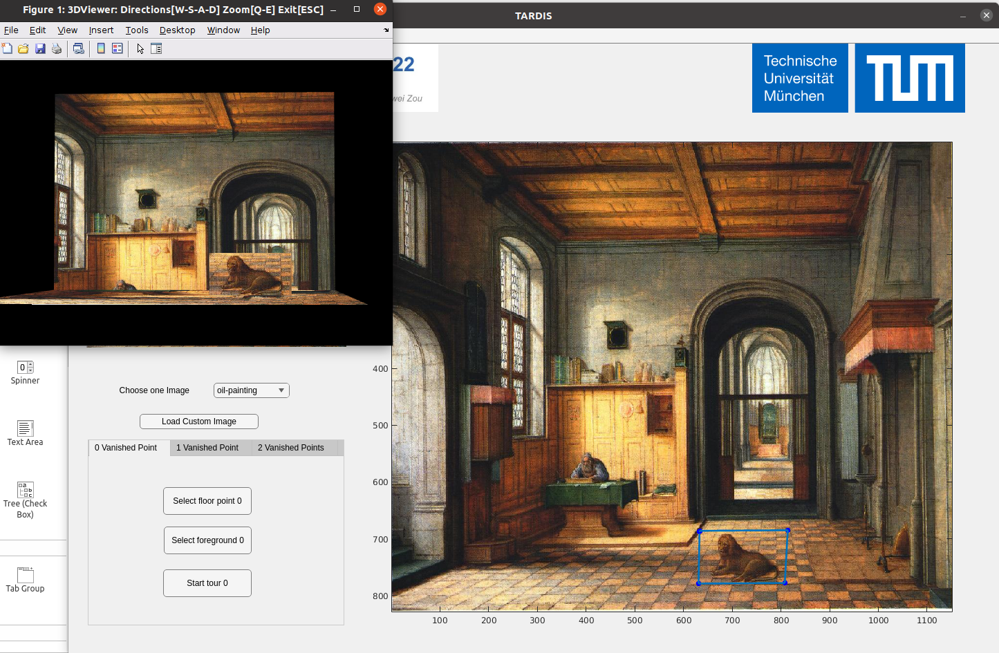
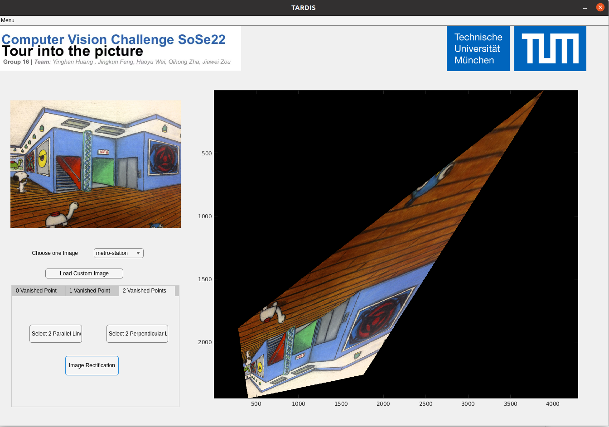
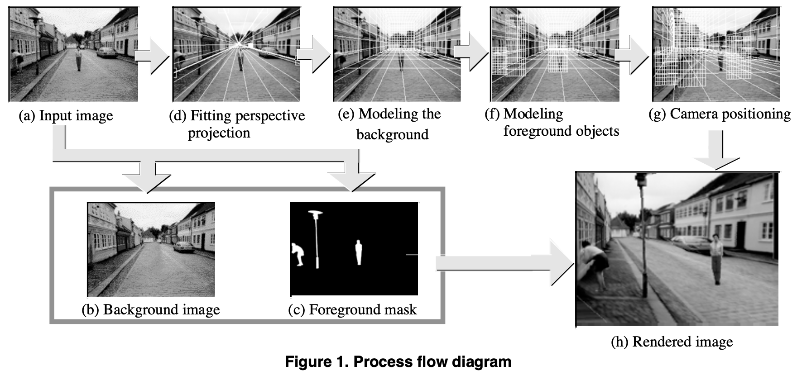

# TUM_CV_Challenge_SS24
TUM Computer Vision Challenge Repo for Matlab 3D reconstruction SS2024

# Pipeline
- Select the intput picture from `./data`

  - Decompisite Background and Foreground objects in input
    - Segementation
    - Inpainting
- Specify the Vanishing Point and Inner Rectangle via GUI
  - implement GUI via HTML

- Fitting perspective projection
- Modeling the background
- Modeling foreground objects
- Camera positioning

# Code references
- [Recommand Matlab implementation](https://github.com/zhaqh-github/CV_Tour_Into_Image)
- [Recommand Matlab implementation](https://github.com/GHLgh/Single-View-3D-Reconstruction)
- [JS implementation](https://github.com/yli262/tour-into-the-picture)
- [C++ implementation](https://github.com/kc885/Tour-Into-The-Picture)

# References
- [Tour into the picture: using a spidery mesh interface to make animation from a single image](https://history.siggraph.org/learning/tour-into-the-picture-using-a-spidery-mesh-interface-to-make-animation-from-a-single-image-by-horry-anjyo-and-arai/)
- [Cut-and-Fold: Automatic 3D modeling from a single image](https://ieeexplore.ieee.org/document/6890555)
