# TUM_CV_Challenge_SS24
**
Tour in Image
**

  
<a href="https://fusheng-ji.github.io"> Wenbo Ji</a> | <a href="https://github.com/DJX2024"> Xiang Ji</a> | <a href="hhttps://github.com/hongru88">Hongru Li</a>  | <a href="https://yuming1227.github.io/">Yuming Li</a>  | <a href="https://github.com/shilinzhang42">Shilin Zhang</a> 

  
Group 31

  
<a href="https://fusheng-ji.github.io/tum_cv_challenge_ss24/index.html">Project Page</a>

  
TUM Computer Vision Challenge for Matlab 3D reconstruction SS2024

## Course Information
- Lecturer: Prof. Dr.-Ing. Klaus Diepold

- Assistant: Luca Sacchetto, Sven Gronauer, Marisa Ripoll
## Usage
- System : WINDOWS and MAC and Ubuntu

- MATLAB Version: tested on MATLAB R2023b

### Start to run
- get in to 'Tour_in_image' dir
- Click 'Start_GUI.mlapp' to run demo directly or run 'main.m' with matlab

### Wellcome Page
In this page we explain the usage of our live demo and references of our method. 

To reach our github repo and project page, you can scan the QR codes on the right side.

Once you click the "Let's go!" button, the demo will start to run.

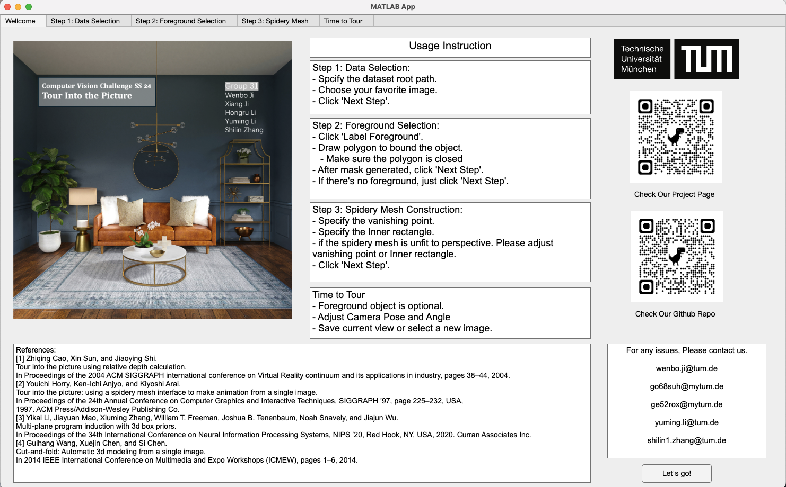
### Data Selection
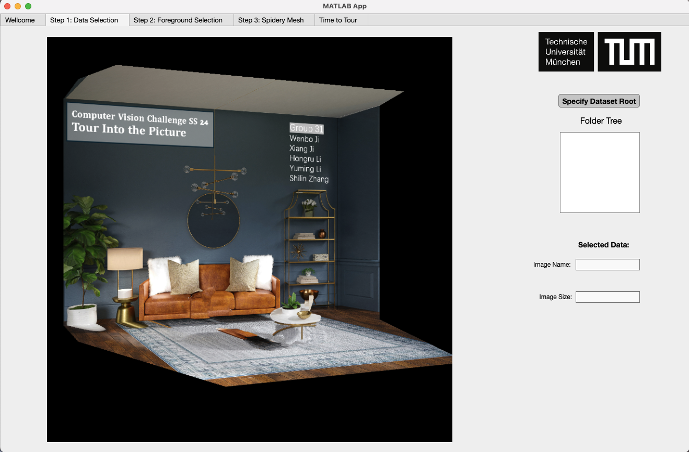
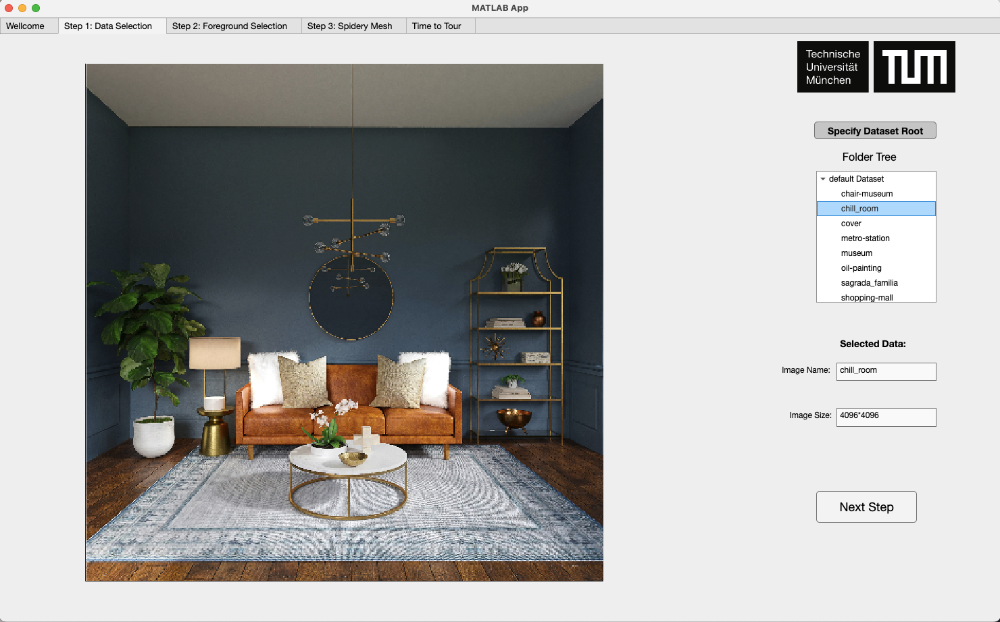
### Foreground Selection
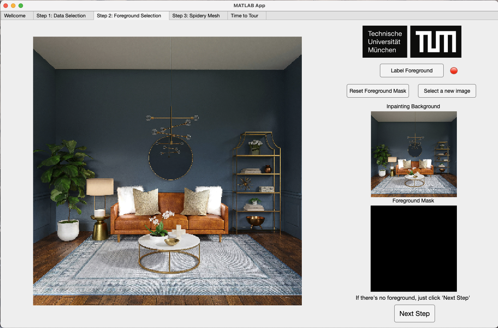
#### Draw Polygon To Select Foreground Object
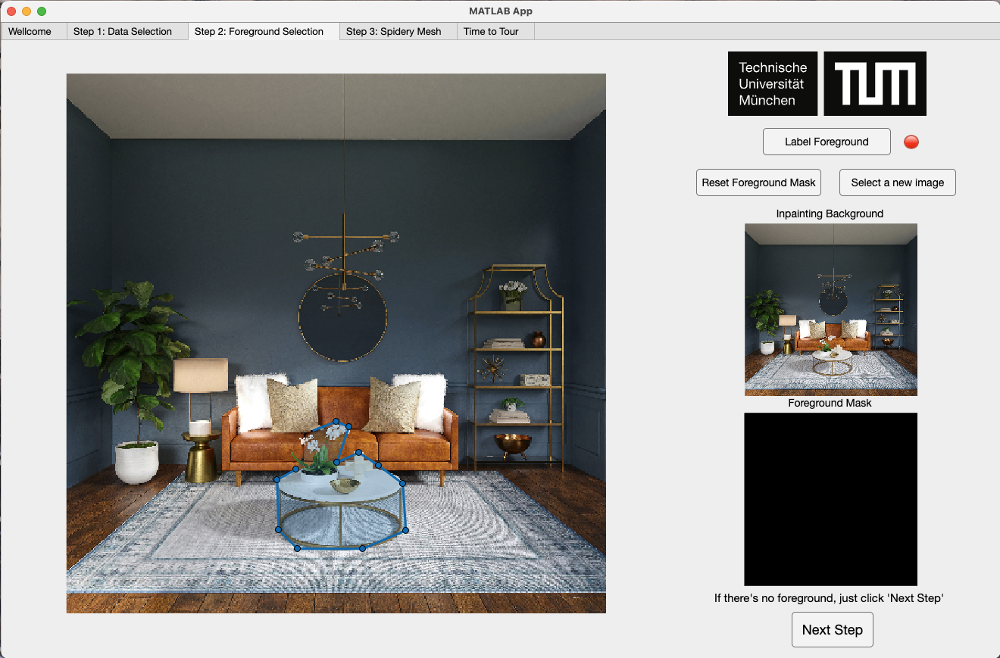
#### Generate Mask
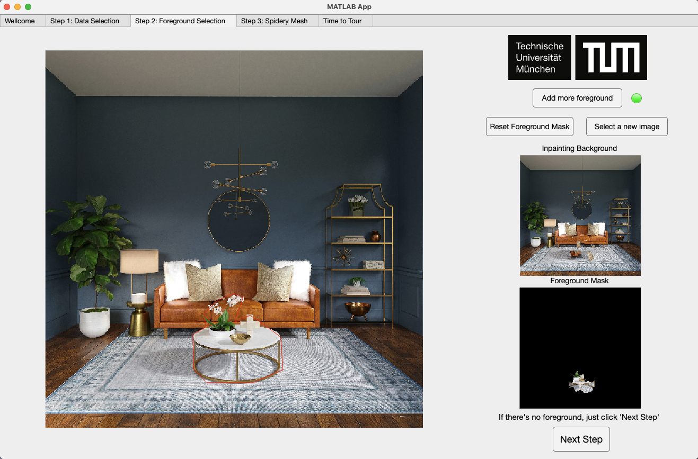
### Setting Spidery Mesh
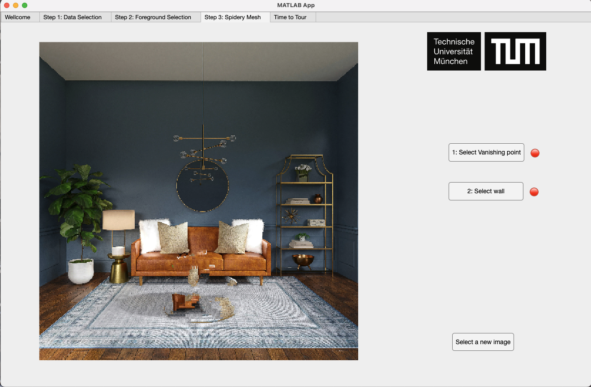
#### Specify Vanishing Point
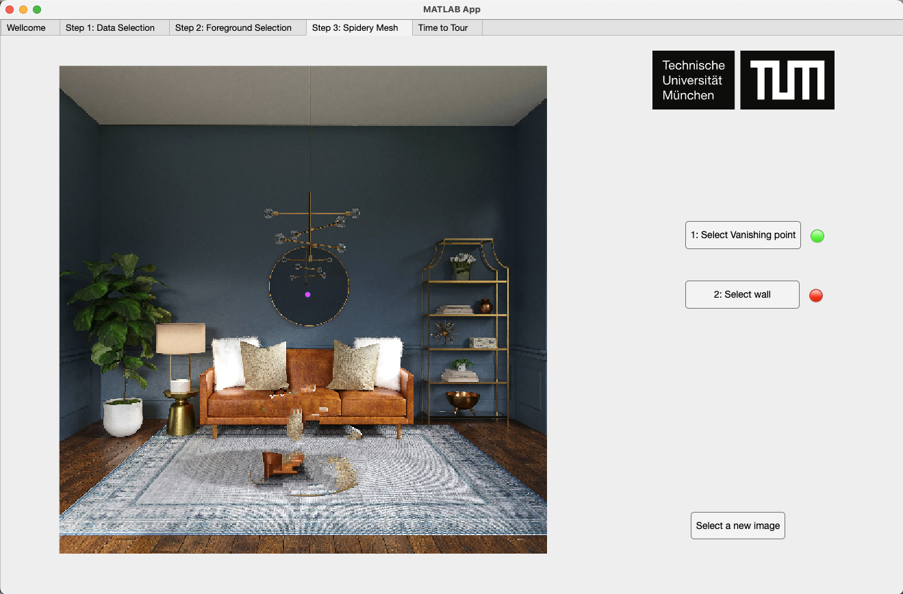
#### Draw Inner Rectangle

Please check if your selection is correct. If it is not correct, you are free to reselect the vanishing point or the rear wall; if you think there is nothing wrong, then please use the `Next Step` button to enter the picture tour. 
### Tour In Image
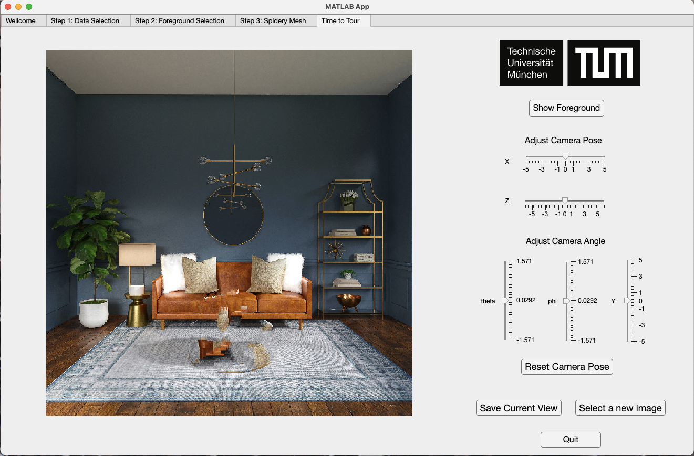
#### Adjust Camera Pose
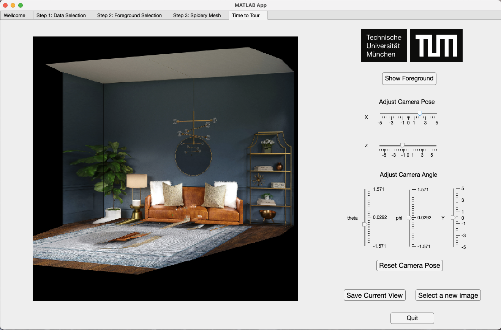
#### Save Current view
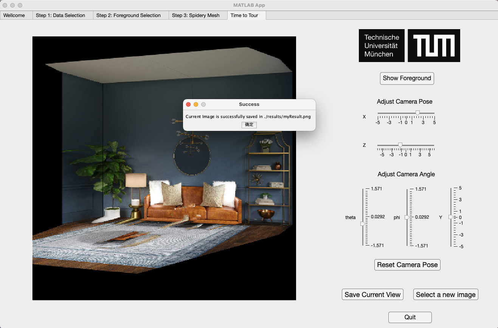

# References
[1] Zhiqing Cao, Xin Sun, and Jiaoying Shi.
Tour into the picture using relative depth calculation.
In Proceedings of the 2004 ACM SIGGRAPH international conference on Virtual Reality continuum and its applications in industry, pages 38–44, 2004.

[2] Youichi Horry, Ken‐Ichi Anjyo, and Kiyoshi Arai.
Tour into the picture: using a spidery mesh interface to make animation from a single image.
In Proceedings of the 24th Annual Conference on Computer Graphics and Interactive Techniques, SIGGRAPH ’97, page 225–232, USA,
1997. ACM Press/Addison‐Wesley Publishing Co.

[3] Yikai Li, Jiayuan Mao, Xiuming Zhang, William T. Freeman, Joshua B. Tenenbaum, Noah Snavely, and Jiajun Wu.
Multi‐plane program induction with 3d box priors.
In Proceedings of the 34th International Conference on Neural Information Processing Systems, NIPS ’20, Red Hook, NY, USA, 2020. Curran Associates Inc.

[4] Guihang Wang, Xuejin Chen, and Si Chen.
Cut‐and‐fold: Automatic 3d modeling from a single image.
In 2014 IEEE International Conference on Multimedia and Expo Workshops (ICMEW), pages 1–6, 2014.